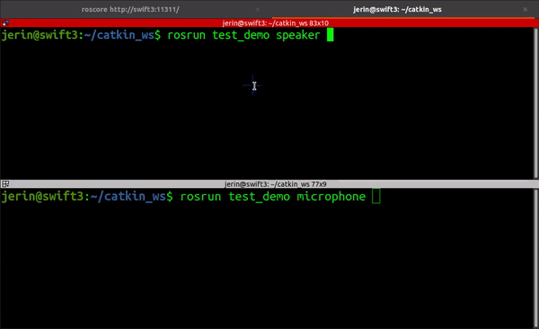

# Simple chat Application based on talker and listener node in :::ROS

## Working in brief 

* Uses 2 nodes Speaker and Microphone
* Both the nodes subscribe and publish to each other
* Used 2 topics

    *  /tomic - for publishing msg from speaker node to microphone node, [subscribed by microhone node]

    * /tospeaker - for publishing msg from microphone node to speaker node, [subscribed by speaker node]

## DEMO

